># Controle-Financeiro-Dindin 💰
## 📂 Descrição do projeto
Projeto realizado como Desafio do Módulo 03 do curso de Desenvolvimento de Software com foco em Back-end na Cubos Academy. O desenvolvimento deste projeto teve como objetivo proporcionar prática no fluxo de trabalho em equipe, a partir da aplicação de metodologias ágeis e explorando o uso de branches para gerenciamento de versões e resolução de conflitos na criação de uma RESTful API integrada ao Banco de Dados, além de ser protegida por criptografia de senhas e autenticação de usuários via Token.

A RESTful API foi desenvolvida para gerenciar receitas e despesas, com integração total ao banco de dados PostgreSQL, permitindo a persistência e manipulação de dados de usuários, categorias e transações, fundamentais para o funcionamento da aplicação. Além disso, foram implementadas medidas de segurança, incluindo a criptografia de senhas e autenticação de usuário por meio de tokens, para garantir a proteção dos dados.

## ⚙ Funcionalidades
* Cadastrar Usuário

* Fazer Login do Usuário

* Detalhar Perfil do Usuário Logado

* Atualizar Perfil do Usuário Logado

* Listar Categorias

* Cadastrar Transações do Usuário Logado

* Listar Transações do Usuário Logado

* Detalhar uma Transação do Usuário Logado

* Atualizar Transação do Usuário Logado

* Remover Transação do Usuário Logado

* Obter Extrato de Transações

* Filtrar Transações por Categoria

## 🛠 Linguagens e Ferramentas utilizadas


![Beekeeper](https://img.shields.io/badge/beekeeper-0D1117?style=for-the-badge&logo=data:image/png;base64,iVBORw0KGgoAAAANSUhEUgAAAA4AAAAOCAMAAAAolt3jAAAAIGNIUk0AAHomAACAhAAA+gAAAIDoAAB1MAAA6mAAADqYAAAXcJy6UTwAAAFNUExURQAAAP//a/rXOvPUOejMN/jWOvjWOenQOP/fPP3VOf/nOf/xP+zSOPzYOvvYOo98IfTTOfjWOvjWOfjWOffWOf//R1xQFUc+EO7NN/jWOvjWOfjWOffWOfjWOf/cO5J+IvjWOfjWOfjWOffWOfjWOfjWOvfWOfjWOvjWOvnXO/nXOvjWOvfWOfjWOfjWOfjWOfjWOfjWOvfWOfjWOfjWOfjWOvfWOfjWOfjWOfnXOjoyDe/ON/vYOvzZOv3aO5WBIjkxDd7AM8esLpJ+ItC0MPrYOvjWOZaBIzUuDKONJqSOJj83DiQfCJSAIvXTOTcvDM2xL/HQOObGNXppHBUTBcCmLO/PN/rXOvvZOuTFNSokCZqFJJiDIyslCuXGNeXFNbyiKxQRBH5sHefHNX1sHRUSBb+lLPTSOI57ISMeCJF9IfTTOXtrHM+zMP///548sBYAAAA5dFJOUwAAAAAAAAAAAAAAAAAAABqI7eyGGQpYx/v7xlYKNa729qw0KtTSKWH6aPxiK9U3sPf3C1rJ/ByK7y1GWkAAAAABYktHRG4iD1EXAAAAB3RJTUUH5wkZEwMcxtjpWwAAAJtJREFUCB0FwdtKw0AUQNG9JydOW6wIUgUviOiL4P//iC8iiC0iFQURvFBCMse1BDxQ9dMJw0P1irX6rrOVnqk5bXXrtaeq6s/y2QiZqer8o8soQlXVKBnA7vtcVSGACx3Yaw0IyNAeNaGUNtZah+Gt78dWupPu6KV+HbN63Cz/cHGj88tXctq1fHJ/uFODMTPvq9AtbpXMh9+Jf7viMqPTlzUXAAAAJXRFWHRkYXRlOmNyZWF0ZQAyMDIzLTA5LTI1VDE5OjAzOjI4KzAwOjAwxaUCOQAAACV0RVh0ZGF0ZTptb2RpZnkAMjAyMy0wOS0yNVQxOTowMzoyOCswMDowMLT4uoUAAAAodEVYdGRhdGU6dGltZXN0YW1wADIwMjMtMDktMjVUMTk6MDM6MjgrMDA6MDDj7ZtaAAAAAElFTkSuQmCC&logoColor=5849BE)


## Executando o projeto

Para começar a utilizar a RESTful API de Controle Financeiro Dindin na sua máquina, siga estas etapas:

```shell
# 1. Faça o Fork do repositório

# 2. Clone o projeto

git clone <um-dos-links-abaixo>

HTTPS:
https://github.com/MarcelaLinhares/Controle-Financeiro-Dindin.git

SSH:
git@github.com:MarcelaLinhares/Controle-Financeiro-Dindin.git

# 3. No VS Code instale as dependências

npm install

# 4. Execute o servidor

npm run dev

```

## Banco de Dados PostgreSQL "Dindin"
Comandos SQL para a criação do Banco de Dados "Dindin" e de suas respectivas tabelas no software Beekeeper ou em um software similar.
- [ ] Banco de Dados Dindin
```sql
CREATE DATABASE dindin;
```

- [ ] Tabela de Usuários
```sql
CREATE TABLE usuarios (
    id serial PRIMARY KEY,
    nome TEXT NOT NULL,
    email TEXT NOT NULL UNIQUE,
    senha TEXT NOT NULL
);
```
- [ ] Tabela de Categorias
```sql
CREATE TABLE categorias (
    id serial PRIMARY KEY,
    descricao VARCHAR(255) NOT NULL
);
```
- [ ] Tabela de Transações
```sql
CREATE TABLE transacoes (
    id serial PRIMARY KEY,
    descricao VARCHAR(255) NOT NULL,
    valor DECIMAL(10) NOT NULL,
    data TIMESTAMP DEFAULT NOW() NOT NULL,
    categoria_id INTEGER REFERENCES categorias(id),
    usuario_id INTEGER REFERENCES usuarios(id),
    tipo TEXT NOT NULL
);
```
- [ ] Inserção das Categorias
```sql
INSERT INTO categorias (descricao) VALUES
    ('Alimentação'),
    ('Assinaturas e Serviços'),
    ('Casa'),
    ('Mercado'),
    ('Cuidados Pessoais'),
    ('Educação'),
    ('Família'),
    ('Lazer'),
    ('Pets'),
    ('Presentes'),
    ('Roupas'),
    ('Saúde'),
    ('Transporte'),
    ('Salário'),
    ('Vendas'),
    ('Outras receitas'),
    ('Outras despesas');
```

## Endpoints no Insomnia
Para realizar as requisições com os verbos GET, POST, PUT, DELETE use o framework Insomnia ou similar.

Abra o insomnia e use o caminho (URL Base):
http://localhost:3000/


- [ ] Cadastrar Usuário - **POST**
```javascript
http://localhost:3000/usuario
```
```javascript
// No body (JSON) preencher os dados da requisição:
{
	"nome": "Marcela",
	"email": "marcela@email.com",
	"senha": "1234"
}
```

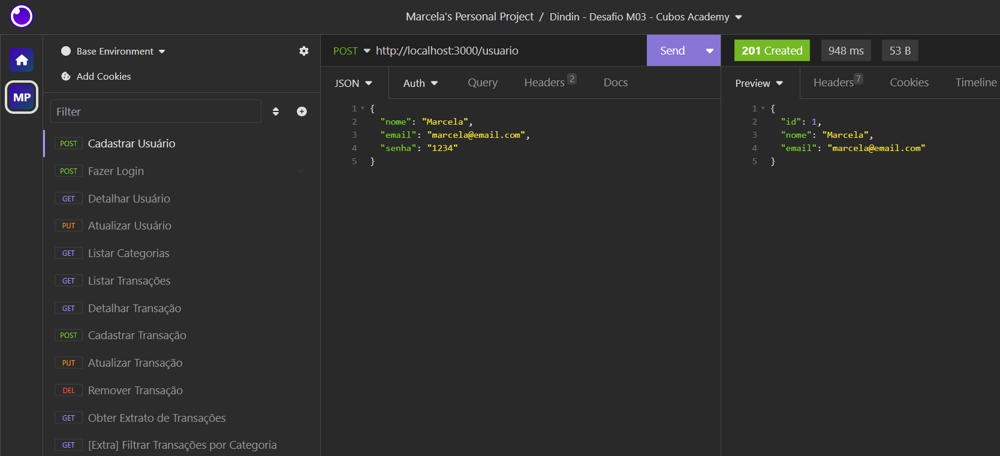

- [ ] Fazer Login do Usuário - **POST**
```javascript
http://localhost:3000/login
```
```javascript
// No body (JSON) preencher os dados da requisição:
{
	"email": "christiane@email.com",
	"senha": "12345"
}
```

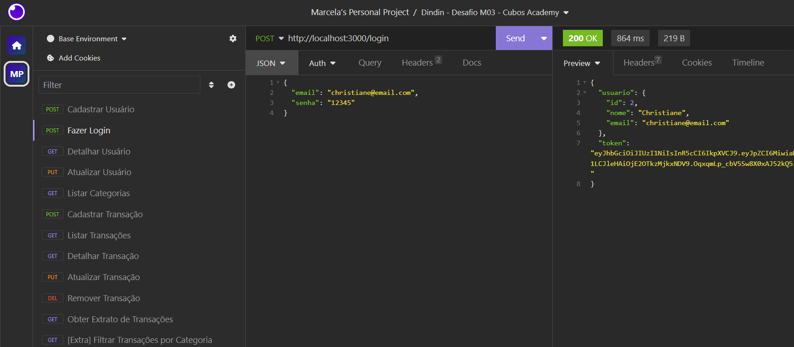

- [ ] Detalhar Perfil do Usuário Logado - **GET**
```javascript
http://localhost:3000/usuario
```
```javascript
// No Auth (Bearer Token) colar o Token gerado no endpoint "Fazer Login do Usuário":
TOKEN <colar-token-gerado-no-login-do-usuario>
```

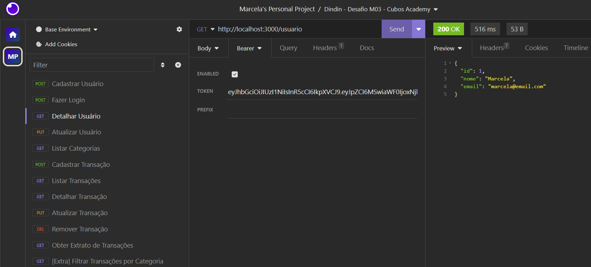

- [ ] Atualizar Perfil do Usuário Logado - **PUT**

```javascript
http://localhost:3000/usuario
```
```javascript
// No Auth (Bearer Token) colar o Token gerado no endpoint "Fazer Login do Usuário":
TOKEN <colar-token-gerado-no-login-do-usuario>
```
```javascript
// No body (JSON) preencher os dados da requisição:
{
	"nome": "Maria Helena",
	"email": "mariahelena@email.com",
        "senha": "1234567"
}
```

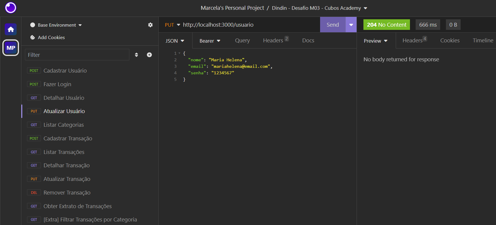

- [ ] Listar Categorias - **GET**
```javascript
http://localhost:3000/categoria
```
```javascript
// No Auth (Bearer Token) colar o Token gerado no endpoint "Fazer Login do Usuário":
TOKEN <colar-token-gerado-no-login-do-usuario>
```

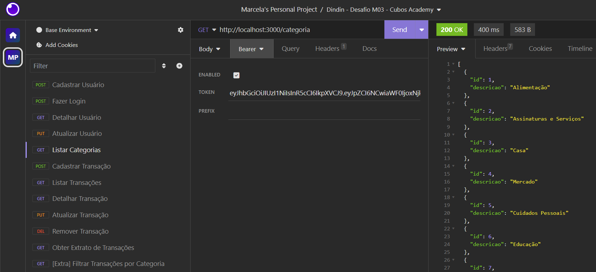

- [ ] Cadastrar Transações do Usuário Logado - **POST**
```javascript
http://localhost:3000/transacao
```
```javascript
// No Auth (Bearer Token) colar o Token gerado no endpoint "Fazer Login do Usuário":
TOKEN <colar-token-gerado-no-login-do-usuario>
```
```javascript
// No body (JSON) preencher os dados da requisição:
{
     "tipo": "entrada",
     "descricao": "Salário out/2023",
     "valor": 1500000,
     "data": "2023-11-06T15:30:00.000Z",
     "categoria_id": 14
}
```

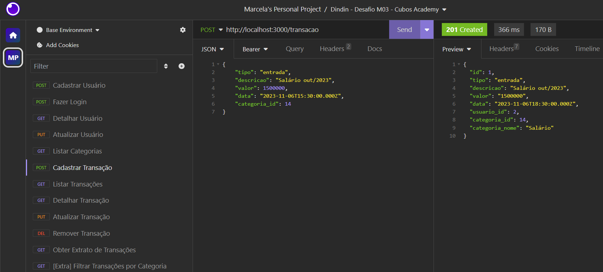

- [ ] Listar Transações do Usuário Logado - **GET**
```javascript
http://localhost:3000/transacao
```
```javascript
// No Auth (Bearer Token) colar o Token gerado no endpoint "Fazer Login do Usuário":
TOKEN <colar-token-gerado-no-login-do-usuario>
```

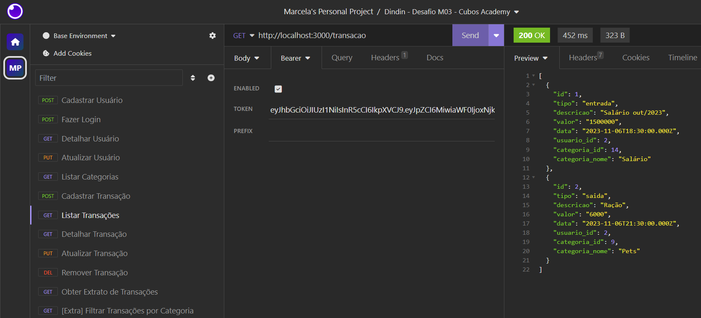

- [ ] Detalhar uma Transação do Usuário Logado - **GET**
```javascript
http://localhost:3000/transacao/:id
```
```javascript
// No Auth (Bearer Token) colar o Token gerado no endpoint "Fazer Login do Usuário":
TOKEN <colar-token-gerado-no-login-do-usuario>
```

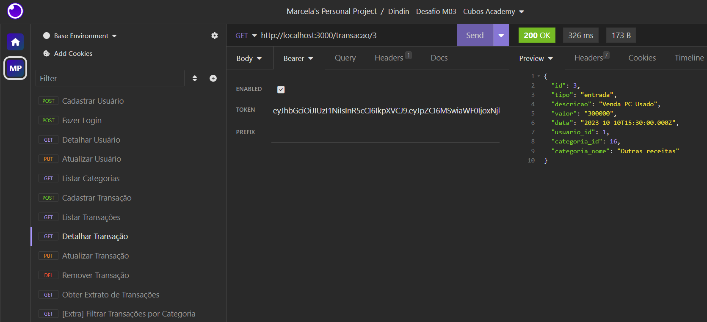

- [ ] Atualizar Transação do Usuário Logado - **PUT**
```javascript
http://localhost:3000/transacao/:id
```
```javascript
// No Auth (Bearer Token) colar o Token gerado no endpoint "Fazer Login do Usuário":
TOKEN <colar-token-gerado-no-login-do-usuario>
```
```javascript
// No body (JSON) preencher os dados da requisição:
{
    "descricao": "Venda de Notebook Usado",
    "valor": 320000,
    "data": "2023-10-12 12:35:00",
    "categoria_id": 16,
    "tipo": "entrada"
}
```

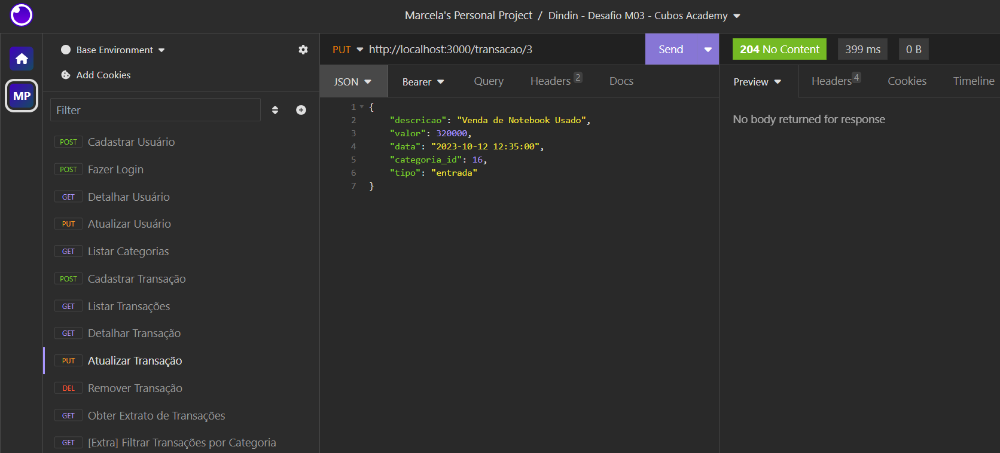

- [ ] Remover Transação do Usuário Logado - **DELETE**
```javascript
http://localhost:3000/transacao/:id
```
```javascript
// No Auth (Bearer Token) colar o Token gerado no endpoint "Fazer Login do Usuário":
TOKEN <colar-token-gerado-no-login-do-usuario>
```

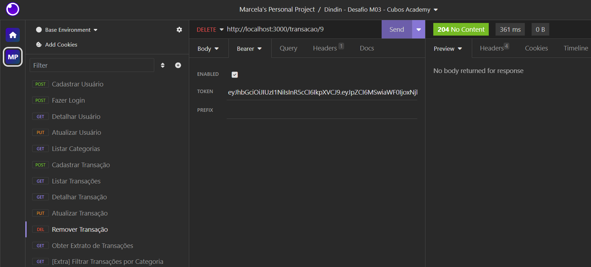

- [ ] Obter Extrato de Transações - **GET**
```javascript
http://localhost:3000/transacao/extrato
```
```javascript
// No Auth (Bearer Token) colar o Token gerado no endpoint "Fazer Login do Usuário":
TOKEN <colar-token-gerado-no-login-do-usuario>
```

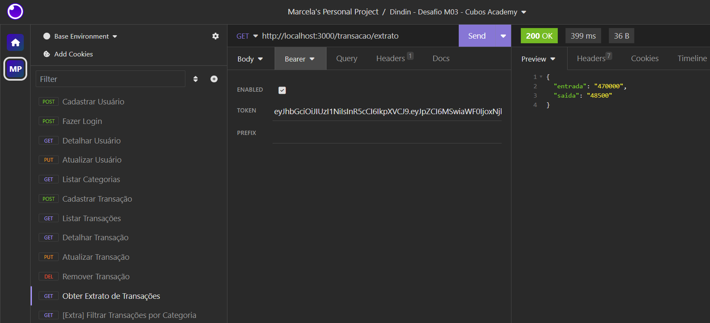

- [ ] Filtrar Transações por Categoria - **GET**
```javascript
http://localhost:3000/transacao
```
```javascript
// No Auth (Bearer Token) colar o Token gerado no endpoint "Fazer Login do Usuário":
TOKEN <colar-token-gerado-no-login-do-usuario>
```
```javascript
// No Query preencher o filtro das Categorias desejadas:
filtro[]       Salário
filtro[]       Pets
```

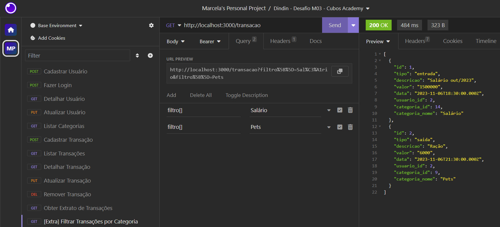

## Dados armazenados no Banco de Dados "Dindin"
Visualização dos dados armazenados no banco de dados "Dindin" para obter uma visão abrangente do sistema de controle financeiro.
Esses dados foram gerados após a aplicação dos endpoints do projeto, e representam a base essencial do sistema e demonstram a funcionalidade da API RESTful integrada ao Banco de Dados PostgreSQL, com recursos de segurança, como criptografia de senhas, para garantir a proteção dos dados.

* **Tabela de Categorias:** Categorias usadas para classificar transações.
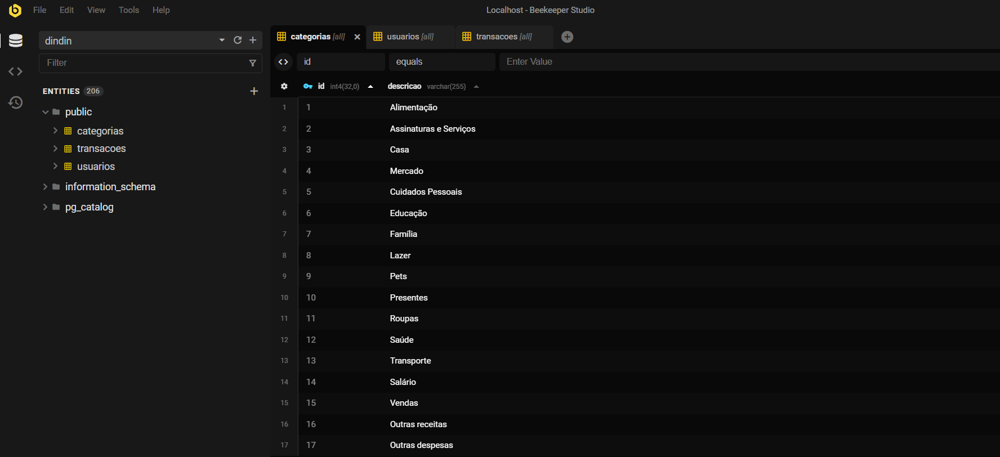

* **Tabela de Usuários:** Esta tabela contém detalhes dos usuários do sistema. Vale ressaltar que a senha é armazenada de forma criptografada para garantir a segurança dos dados.


* **Tabela de Transações:** Registros de todas as transações financeiras.
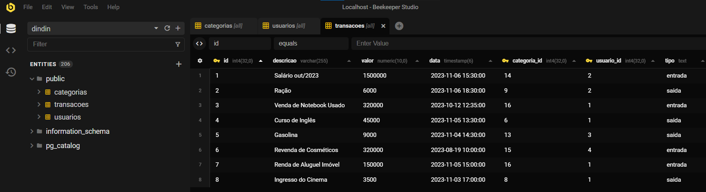

## Contribua com o Projeto

- [ ] Realize o Fork
- [ ] Faça as modificações
- [ ] Realize o Pull Request (PR)

## Desenvolvedoras

<table>
  <tr>
    <td align="center"><a href="https://github.com/MarcelaLinhares"><br /><sub><b>Marcela Linhares</b></sub></a><br /></td>
   
  <td align="center"><a href="https://github.com/christianebs"><br /><sub><b>Christiane Barbosa</b></sub></a><br /></td>
